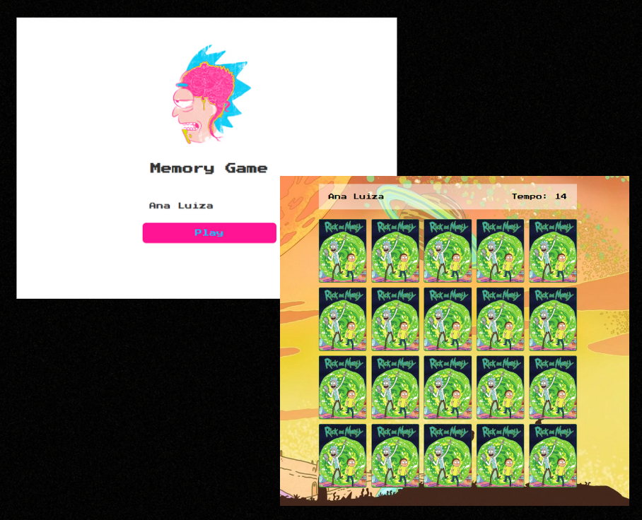

<h1 align="center"> Memory Game 🎮 </h1>

# Sobre o jogo 🎮
Esse projeto foi feito para aperfeiçoar minhas habilidades com o JS na criação de funções e eventos. 

# Como acessar o jogo? 🎯

Basta clicar [AQUI](https://analudms.github.io/MemoryGame/) que você será direcionado!

# Apresentação 👀

  

# Tecnologias 💻
- HTML e CSS.
- JavaScript.
- Git e Github.

# Inspiração 💡

Projeto feito a partir de uma vídeo aula gratuita no Manual do Dev no Youtube 📺. 
https://www.youtube.com/watch?v=SjtdH3dWLa8&ab_channel=ManualdoDev

# Autor 👩🏻

Ana Luiza de Melo Soares.  
https://www.linkedin.com/in/ana-luiza-melo-8b94181b3/